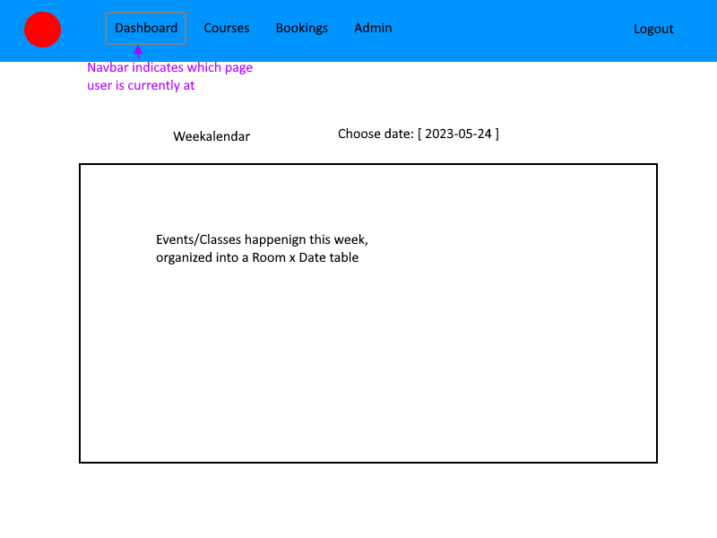
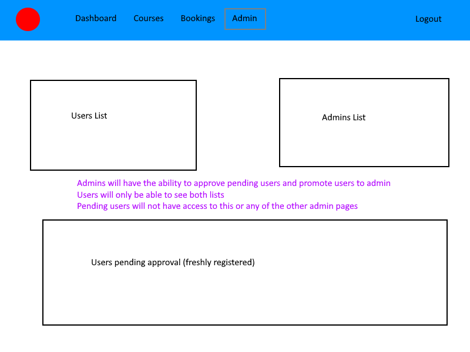
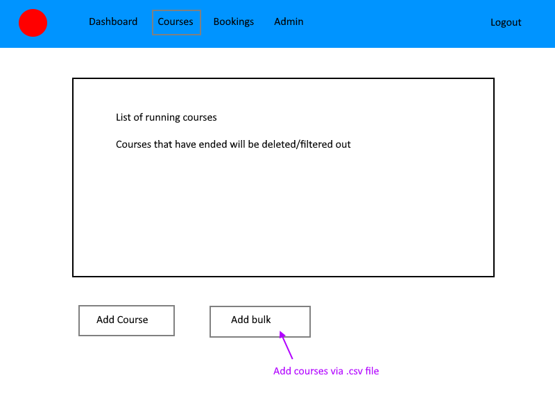
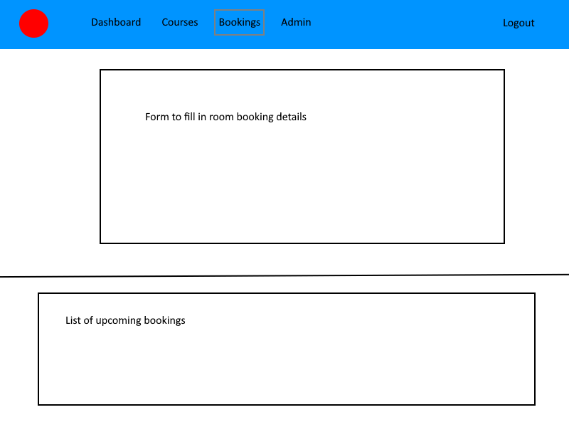

# GADisplay

Full stack app to display class timings on a Samsung Galaxy Tablet A and to provide an administrative interface for laptops/computers to schedule events.

# Technologies used

## Javascript

This app was built with Javascript, utilizing the React.js framework, for front-end and with Python, using the Flask framework, for back-end. PostgreSQL was used as the app's database.

## Front-end

### <a href="https://react.dev" target="_blank" >React.js</a>

This app was built with the React.js, with several grand components acting as pages, linked via React Router v6.11. For each page, specialized components were built to display information as required or enable functionality as desired.

### CSS & <a href="https://getbootstrap.com/" target="_blank" >Bootstrap</a>

CSS was used heavily to finely control design and positioning of elements. Bootstrap was used to provide responsive breakpoints for element sizing, which was crucial considering the app had to be usable on both PC and tablet devices.

### <a href="https://www.papaparse.com/" target="_blank">Papaparse</a>

Papaparse package was used to parse .csv files, allowing for bulk data entry via converted spreadsheets.

## Back-end

### <a href="https://www.python.org/" target="_blank">Python</a>

Aside from being a personal challenge, Python was also chosen to build this app's server due to its wide variety of packages, created by its large community to support and facilitate development of various types of apps.

### <a href="https://flask.palletsprojects.com/en/2.3.x/" target="_blank">Flask</a>

### <a href="https://www.sqlalchemy.org/" target="_blank">SQLAlchemy</a>

Via Flask-SQLAlchemy, SQLAlchemy was used as an Object Relational Mapper to relate Python code to SQL queries to a PostgreSQL database without needing to write raw SQL queries.

### <a href="https://marshmallow.readthedocs.io/en/stable/" target="_blank">Marshmallow</a>

A (de)serialization library, used to convert data from front-end and data from the database into Pythonic datatypes, allowing for manipulation via Python-based back-end.

### <a href="https://github.com/Pylons/waitress" target="_blank">Waitress</a>

Production WSGI server used for deployment. Chosen primarily for its compatability with both Windows and Unix.

## Database

### <a href="https://www.postgresql.org/" target="_blank">PostgreSQL</a>

SQL database used to leverage on its nature to strictly constrain data, preventing invalid data from going into the wrong tables.

# General Approach

Functionalities of this app was largely determined via consultation with a staff member using a similar app, who expressed which parts of the other app could have been improved upon and what new features they would have liked to see in such an app.

From the staff's feedback, I worked on tackling the issues the previous app had, ensuring at each stage of development that similar issues would not occur or, at least, be properly addressed.

After which, I worked on developing additional features the staff had wanted to see.

<br/>

## Front-end

### User authentication

I first started by portioning the app into parts that require admin access and parts that would be fine for unauthorized users to play with. From there, I set up the routes in app, ensuring to protect all admin routes via access tokens. To verify access tokens and ensure that users do not try to force their way into accessing the app, a whitelist was implemented to ensure that only the most recently generated token for each user would be valid.

### Improving upon features

Feedback from the staff on the other app guided development of this app, as I started working on features that the staff had praised in the other app whilst tackling the downsides they had mentioned.

Such features included the weekly calendar, which could previously navigate to old dates where events had already expired and been deleted from the database and was improved upon by limiting that fact and also allowing the weekly calendar to display ad-hoc events.

### Developing useful features

Based on what the staff had wanted to see in the other app and with heavy consideration on user experience, I developed additional features to make the app easier to use or grant it additional management functionalities.

For example, the ability to add multiple courses via .csv was implemented to allow for better user experience, removing the need for them to add courses one by one.

Also, user management was a feature added to allow admins to manage permissions and access to the app by users.

<br/>

## Back-end

### Models

Object Relational Models (ORM) were established via SQLAlchemy, allowing for mapping of database table rows to Python objects. Marshmallow schemas were used to provide an additional deserialization step, converting these objects to Python dictionaries, facilitating manipulation of data.

### Routes & Blueprints

The server created for this app provided many different end points, which would have been troublesome to organize and maintain if all of the end points were implemented within a few files. As such, these endpoints were scoped and organized into Flask Blueprints, in which they could be assigned url prefixes and allow for more relevant URL names.

### Authentication

Authentication was achieved via PyJWT and facilitated with helper functions from the Flask-JWT-Extended package. Wherever endpoints were called which could manipulate the database or retrieve sensitive information, requests were validated, checking for authorization via access/refresh tokens.

Access and refresh tokens were also white-listed (or in other terms reverse black-listed or block-listed) and as such, aside from token expiry, tokens submitted by a user when accessing an endpoint were also checked that they were the same tokens generated on that user's most recent login.

## Challenges

1. One of the biggest challenges was developing the server in Python, a language I had not been particularly familiar with prior to this project. As I was unfamiliar with Python terminologies or common functions/packages, researching on the Pythonic way to do things that I would have easily done in Javascript was a complicated endeavour.
2. Another challenge was learning how to deal with React.js's reactive states. As the app's display pages were heavily reliant on a timer to update the displayed event, I had naively used Javascript's setTimeout/setInterval methods to start my timer. However, for the large part of development, I had not realized that these methods did not work very well in React due to how reactive states worked.

## Solutions and/or mitigation attempts

1. Naturally, to overcome the challenge of not being familiar Python was to simply learn Python. This was achieved by going back to the drawing board, breaking down what I had wanted to do in Javascript, learning how to do each of them in Python or learning the Pythonically-equivalent way and consolidating all of them.
2. When I had realized that the timers were not working properly, I had to research how to properly implement a timer in React, as ooposed to implementing a timer in raw Javascript. After much trial and error and consulting various forums discussing this issue in React, I lucked upon <a href="https://overreacted.io/making-setinterval-declarative-with-react-hooks/" target="_blank">an article by Dan Abramov</a>, which explained the issue and aided me in setting up a custom useInterval hook to overcome this problem.

# Dependencies

On top of React.js and Python, this app is dependent on these following packages.

## Front-end

- React Router DOM v6.11 <br/>`npm i react-router-dom`
- JSON Web Token decode <br/>`npm i jwt-decode`
- Papaparse <br/>`npm i papaparse`

## Back-end

Full dependencies in requirements.txt, listed below are the main packages used.

- Flask v2.25
- psycopg2 v2.9.6
- Flask-JWT-Extended v4.5.2
- Flask-SQLAlchemy v3.0.3
- Flask-marshmallow v0.15.0
- argon2-cffi v21.3.0

## PostgreSQL

- uuid-ossp <br /> `CREATE EXTENSION "uuid-ossp"`

# User Stories

This app was created to schedule and display real-time classes and events.
Display of events was intended to be done on a Samsung Galaxy Tablet A (800px by 1112px when positioned vertically).
Scheduling was intended to be done on the administrative side, via a token-authenticated administrative interface and managed via protected endpoints to a database.

## Features

### Responsive styling for display of events

As upcoming events were meant to be displayed on a tablet near the event venue, event-display pages were specifically styled to have elements responsively fit on the tablet screen, with several alternate stylings for when event names get too long, preventing elements from overflowing off screen.

### On-the-dot schedule progression

In the event display page, the app will request data from the database to obtain an updated list of all events to schedule for each room. The data is then validated, getting rid of events that have expired and showing the next upcoming event, defaulting to the class scheduled for that day if no events were to be found.

Based on a timer specified via CLIENTREFRESHMINUTES, the app will access data currently available client-side and change the display if the current event has ended.

Every so often, as specified via SERVERREFRESHMINUTES, the app will perform another request to the database to update its set of data, ensuring that if events are added within this time, users do not have to refresh the app to update data available client-side.

### Privileged access

When accessed without a valid account, the app has extremely minimal interactability. A public user would only be able to navigate between the landing page, room displays and if they're lucky, access the hidden login page where they can at most register a new account, which would be subject to approval by an admin. All other pages of the app can also be navigated to if a public user happened upon the correct url, however they would require a whitelisted access token to utilize any administrative functions.

### Weekalendar

Dashboard of the admin app provides a concise glance at the upcoming events for the week. Date can even be specified to see what happens in a particular week, although date of the weekalendar cannot be set to a passed date, as old events would have been cleared from the database.

Weekalendar manages overflow, expanding the table when several events happened to be scheduled for a day and converting long names to ellipses to prevent names from spilling over into the wrong columns.

### Managing courses

A course management page display a list of running courses and details crucial for planning and managing the courses.

Each course in the list can be edited or deleted as desired. New courses can be added singly, by filling in the form, or in bulk, by providing a .csv file with the appropriate column headers.

Input validation ensures that incomplete or dirty .csv data cannot go through to the database and potentially break the app.

### Ad-hoc event scheduling

Events can be scheduled ad-hoc and will be granted priority above running courses.

Events created are shown in a list, along with which user created said event.

### User management

An admin page displays all users recorded in the database, which includes admins, users and accounts pending approval.

Admins would be able to approve/delete accounts and promote users while users will only be able to see what accounts are available.

# Wireframes and Designs

## ERD


## Public pages (Landing and Display Page)


## Admin pages

Login Page


Dashboard


User Control


Courses management


Adhoc/Bookings management


# How to use

1. Install the packages specified in package.json `npm i`.
2. Setup front-end .env file with the following:

```
VITE_SERVER="Back-end-url"
VITE_SERVERREFRESHTIMER="How many minutes before getting new data"
VITE_CLIENTREFRESHTIMER="How many minutes before changing display"
```

3. Install Python requirements as per requirements.txt.
4. Setup back-end .env file with the following:

```
FLASK_RUN_HOST=
FLASK_RUN_PORT=
FLASK_APP=server.py
SQLALCHEMY_DATABASE_URI="database URI"
JWT_SECRET_KEY="secret-key"
SEED_PW="password to check against when seeding users"
```

5. Start the server via `flask run` (for development) or via a WSGI server.
6. Call upon the Course_Types, Days_Schedules, Roles and Rooms seed endpoints to prime the database.
7. Use psql to assign your selected account admin/user role (role in the app, not role in the database) and begin exploring the app!
